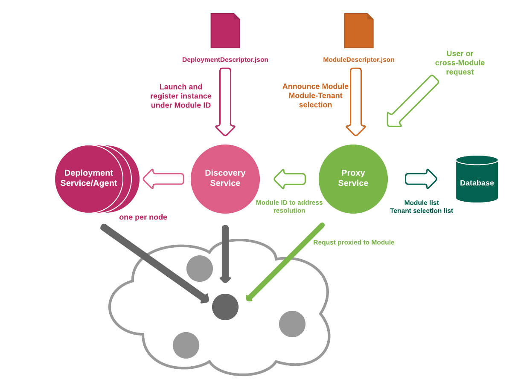
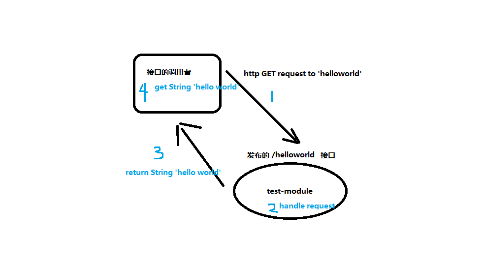
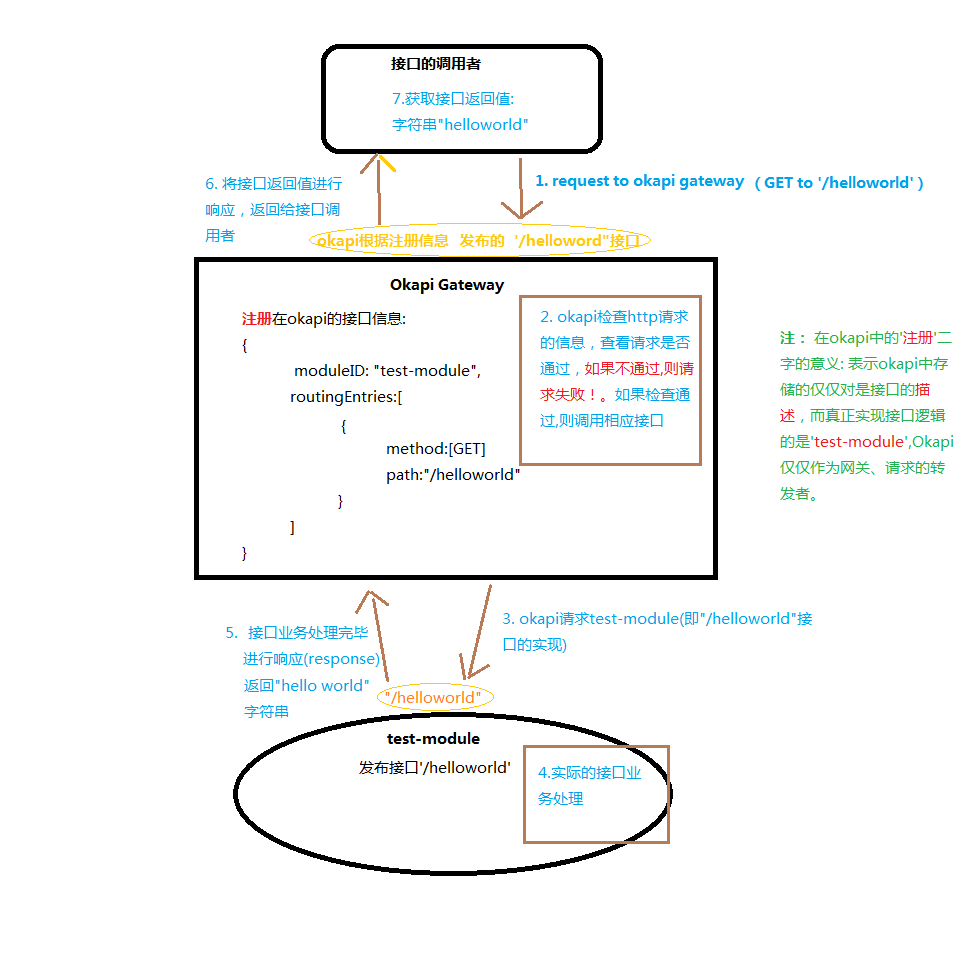
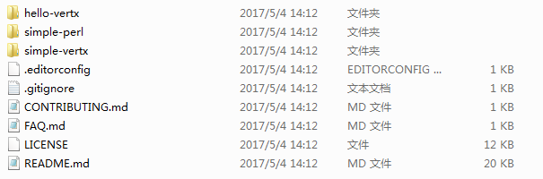
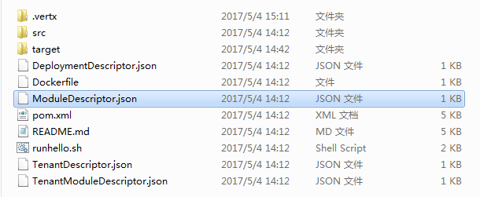
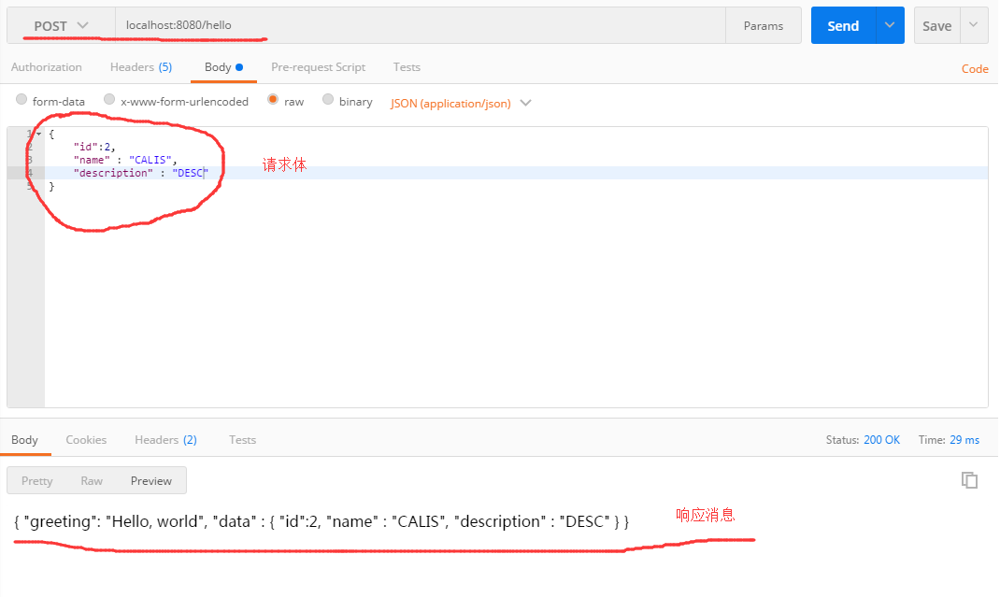
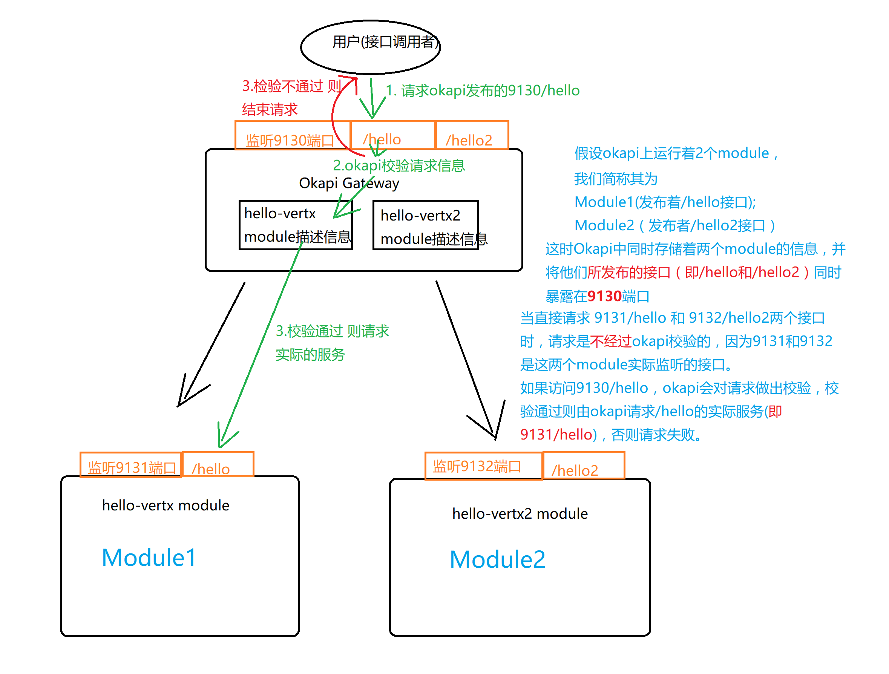

[TOC]


# Okapi应用说明书

## 前言

说到okapi，则必须先要了解FOLIO(future of library is opent)：FOLIO是一套开源的，云服务基础应用框架，专门为了解决图书馆业务需求而设计。而okapi则是FOLIO之内的核心微服务组件。


作者注：本文仅对okapi的**使用方式**进行必要的说明，以方便okapi的使用者**快速入门**，并不对okapi的原理进行深入剖析。okapi可以分布式的运行在不同的服务器节点上，但是本文的前几章先**着重介绍**微服务和okapi运行于**同一个节点**的情况下okapi的使用说明，集群模式与单机模式的使用方式大同小异，本文最后简单补充说明okapi的集群化部署。


作者建议：本文主要内容是作者自从研究okapi以来，使用okapi的个人心得以及常见问题解决方案的小规模总结，比较适合读者快速入门。因为okapi的官方文档已经非常详细，所有为了简化不必要的叙述，本文中有多处直接引用或者复制了官方文档。在阅读本文时，请读者***务必留意特殊字体***的部分，这些部分是作者认为比较重要或者有助于深入学习的内容。读者可沿着本文的思路作为学习路线，在大体了解本文之后，需要消息深入学习的知识则可以根据文档链接（或者直接访问FOLIO[官方网站](http://dev.folio.org)），进行拓展补充。


## okapi简介

简单来讲Okapi是用来发布微服务的API Gateway，下图为Okapi的架构图(具体架构设计思路请参看[okapi官方文档](https://github.com/folio-org/okapi/blob/master/doc/guide.md)： 我们先以使用为目的，此处暂不对该图进行深入说明)。





这里称我们企业开发的微服务项目为一个module，我们的module对外发布的是**HTTP**接口。

每一个module都应该是可以 **独立运行(不依赖于okapi而存在)** 的项目。通俗理解，Okapi所做的工作是将这些独立运行的modules统一地管理起来并控制其访问权限以及发布状态。所有发布在okapi上的modules所收到的请求 全部来自于okapi的转发。换而言之，用户向微服务所发出的请求，实际全部都由okapi Gateway 来接收，随后okapi根据modules注册的接口信息，对相对应的module接口进行调用 返回相应信息。总而言之，可以将Okapi理解为一个http请求的**转发者**。

举例来说：假设 我们有一个module(我们称之为test-module)提供了一个GET方式的http接口，该接口的path为：‘/helloworld’  接口的返回值为字符串”hello world” 

如果test-module独立运行于web容器中 其请求流程可以理解为下图：




如果通过okapi进行接口发布，则请求处理流程可以**粗略理解** 为下图：



加入okapi之后的流程 大致可以看做图中**蓝色字体**的说明内容。此处说明一下图中流程(***2***)，okapi接收到http请求之后 会在内部对**请求头信息**以及**请求参数格式**等进行校验，流程(***2***)中省略了很多okapi内部的处理过程，实际上 okapi内部对http请求的校验过程比较复杂，出于应用的目的，本文也不对其内部进行深入说明。


注：读过本章节之后，读者很可能对okapi的概念依旧模糊，建议看过**okapi应用**章节之后 再回过头去理解上述流程，会使读者更加了解okapi。


## okapi的使用

okapi在我们的系统中充当着网关的角色，它负责所有的请求处理、接口发布、(**module部署**)等等功能........ 其中okapi负责“**module部署**” 一项仅针对以本文的场景(**okapi和module运行在同一服务器节点上**)。当然，现实当中企业中的微服务module大多数都不会依赖于okapi而启动，并且一般都会运行在不同的节点。这种情况下，有待文档完善再做介绍。

### okapi系统要求

+ Java 8 JDK 1.8.0-101 or higher
+ Maven 3.3.9 or higher
+ Node.js 6.x or higher
+ Yarn package manager v0.20.3 or higher
+ Docker(可选，如果用到docker则***尽量使用***新版本)

作者撰写本文时，运行环境为ubuntu16，例如 git 、maven 等开发者常用的工具默认读者在系统中已经安装。

### 运行

启动整个应用系统，大致分为几个步骤：

+ 1.启动网关；
+ 2.在网关中注册module的接口信息；
+ 3.部署module。

#### 1.启动网关

既然Okapi为 ’网关’ ，掌握着所有请求的处理，那么在一个应用到okapi的系统之中，Okapi则必然要最先启动。

首先在创建一个目录(位置读者自选)作为okapi的“安装目录”，我们称其为**$FOLIO_ROOT**。随后按照下列命令依次执行(从git上下载代码，maven编译)，console中的信息如下。

```shell
$ cd $FOLIO_ROOT   # Set in lesson one of the tutorial
$ git clone --recursive https://github.com/folio-org/okapi.git
  Cloning into 'okapi'...
  remote: Counting objects: 11346, done.
  remote: Compressing objects: 100% (55/55), done.
  remote: Total 11346 (delta 21), reused 0 (delta 0), pack-reused 11283
  Receiving objects: 100% (11346/11346), 1.95 MiB | 415.00 KiB/s, done.
  Resolving deltas: 100% (5820/5820), done.
$ cd okapi
$ mvn install
  [...]
  [INFO] ------------------------------------------------------------------------
  [INFO] Reactor Summary:
  [INFO]
  [INFO] okapi .............................................. SUCCESS [  0.464 s]
  [INFO] okapi-common ....................................... SUCCESS [  5.545 s]
  [INFO] okapi-test-module .................................. SUCCESS [  1.191 s]
  [INFO] okapi-test-auth-module ............................. SUCCESS [  0.731 s]
  [INFO] okapi-test-header-module ........................... SUCCESS [  0.670 s]
  [INFO] okapi-core ......................................... SUCCESS [ 27.901 s]
  [INFO] ------------------------------------------------------------------------
  [INFO] BUILD SUCCESS
  [INFO] ------------------------------------------------------------------------
  [INFO] Total time: 37.231 s
  [INFO] Finished at: 2017-02-27T16:56:58-05:00
  [INFO] Final Memory: 62M/490M
  [INFO] ------------------------------------------------------------------------
```

此时,okapi的代码已经被下载并且编译成为一个fat-jar。

编译之后，执行如下的命令开启okapi网关

```shell
$ cd $FOLIO_ROOT/okapi   # Set in lesson one of the tutorial
$ java -Dloglevel=DEBUG -jar okapi-core/target/okapi-core-fat.jar dev
  12:08:11 INFO  MainVerticle         git: git@github.com:folio-org/okapi 225c9c1e03c29459da430f93110abb30378e1394
  12:08:11 INFO  MainVerticle         clusterManager not in use
  12:08:11 INFO  MainVerticle         Proxy using inmemory storage
  12:08:12 WARN  Storage              Storage.resetDatabases: NORMAL
  12:08:12 INFO  TenantWebService     All tenants deployed
  12:08:12 INFO  MainVerticle         API Gateway started PID 64161@Walkabout.lan. Listening on port 9130
```

当控制台出现上述信息时，表示okapi已经开启并开始监听9130端口(注：该端口可以在启动okapi的命令中添加 ‘-Dport=xxx’参数手动指定)

然后在shell中执行：

```shell
$ curl –w ‘\n’ –D – localhost:9130/_/discovery/nodes
```

或者直接在浏览器中访问 “localhost:9130/_/discovery/nodes”

返回json：’ [ { "nodeId" : "localhost", "url" : "http://localhost:9130" } ]’ 则表示okapi运行成功。


另一种启动okapi的方式：

```shell
$ cd $FOLIO_ROOT/okapi   # Set in lesson one of the tutorial
$ mvn exec:exec
```

作者个人建议用第一种方式启动okapi(java命令)


##### okapi通用命令

###### okapi的启动命令结构如下:

```sh
java [java-options] -jar path/okapi-core-fat.jar command [options]
```

注：由于目前的情景前提是**只有一个okapi节点**，因此在前一节 启动okapi的命令中 command参数为 dev

参数说明官网已经详细指出，此处引用之(初识okapi的读者 ！！***请跳过以下相关的内容***！！ ，直接阅读 “**2. 在网关中注册module的接口信息**”一章)：

**Java -D options**

The -D option can be used to specify various run-time parameters in Okapi. These must be at the beginning of the command line, before the -jar.

- `port`: The port on which Okapi listens. Defaults to 9130
- `port_start` and `port_end`: The range of ports for modules. Default to port+1 to port+10, normally 9131 to 9141
- `host`: Hostname to be used in the URLs returned by the deployment service. Defaults to localhost
- `storage`: Defines the storage back end, **postgres**, **mongo** or (the default) **inmemory**
- `loglevel`: The logging level. Defaults to INFO; other useful values are DEBUG, TRACE, WARN and ERROR.
- `okapiurl`: Tells Okapi its own official URL. This gets passed to the modules as X-Okapi-Url header, and the modules can use this to make further requests to Okapi. Defaults to http://localhost:9130 or what ever port specified. There should be no trailing slash, but if there happens to be one, Okapi will remove it.
- `dockerUrl`: Tells the Okapi deployment where the Docker Daemon is. Defaults to http://localhost:4243.
- `postgres_host` : PostgreSQL host. Defaults to **localhost**.
- `postgres_port` : PostgreSQL port. Defaults to **5432**.
- `postgres_username` : PostgreSQL username. Defaults to **okapi**.
- `postgres_password`: PostgreSQL password. Defaults to **okapi25**.
- `postgres_database`: PostgreSQL database. Defaults to **okapi**.
- `postgres_db_init`: For a value of 1, Okapi will drop existing PostgreSQL database and prepare a new one. A value of 0(null) will leave it unmodified (default).


**Command**

Okapi requires exactly one command to be given. These are:

- `cluster` for running in clustered mode/production
- `dev` for running in development, single-node mode
- `deployment` for deployment only. Clustered mode
- `proxy` for proxy + discovery. Clustered mode
- `help` to list command-line options and commands
- `initdatabase` drop existing data if available and initializes database
- `purgedatabase` drop existing data and tables


**Command-line options**

These options are at the end of the command line:

- `-hazelcast-config-cp [file]` -- Read config from class path
- `-hazelcast-config-file [file]` -- Read config from local file
- `-hazelcast-config-url [url]` -- Read config from URL
- `-enable-metrics` -- Enables the sending of various metrics to a Carbon back end.
- `-cluster-host [ip]` -- Vertx cluster host
- `-cluster-port [port]` -- Vertx cluster port


#### 2.在网关中注册module的接口信息

此处我们使用官方提供的Demo module 作为演示：

从以下git地址 下载demo工程

```shell
$ cd $FOLIO_ROOT
$ git clone https://github.com/folio-org/folio-sample-modules.git
```

下载之后 $FOLIO_ROOT目录下会有多出一个 ‘folio-sample-modules’目录，进入该目录可以看到其结构：



该目录下分别有’hello-vertx’ ‘simple-vertx’ ‘simple-perl’三个工程，每一个工程可以称为一个**module**，其中’hello-vertx’ ‘simple-vertx’是基于**vert.x框架**实现的java工程，而“simple-perl”是perl语言的工程(不在本文的讨论范围以内) 
而我们先只用到hello-vertx工程。我们先对该工程简单的做一个介绍，hello-vertx因为使用了vert.x（vertx-web api），所以本身是一个web容器，该工程对外发布了rest接口如下：
1 .GET方式的’/hello’ 返回值为’Hello World’ 字符串 ;  
2.POST方式的’/hello’ 返回值为一个json: {“greeting”:”Hello World”, “data”:{ …… }}
该工程的具体实现可以参看其源码（**很简单 只有一个MainVerticle类**）。

进入该工程目录



执行以下命令（请关注***ModuleDescriptor.json***文件中的内容，以及该命令请求的url路径：’***/_/proxy/modules*** ’ ， 关于该路径 本文会在后面的章节进行介绍）

```shell
$ curl -w '\n' -X POST -D -   \
   -H "Content-type: application/json"   \
   -d @ModuleDescriptor.json \
   http://localhost:9130/_/proxy/modules
```

---


```json
// ModuleDescriptor.json文件内容
{
  "id" : "hello",
  "name" : "Hello World",
  "provides" : [ {
    "id" : "hello",
    "version" : "1.1",
      "handlers" : [ {
      "methods" : [ "GET", "POST" ],
      "pathPattern" : "/hello"
    } ]
  } ],
  "launchDescriptor" : {
    "dockerImage" : "folio-hello-module" //请**留意**此属性！！！！
  }
}
```

该文件对hello-vertx Module的信息做出了必要的描述:

+ hello-vertx在okapi中的注册id为’hello’(**该id值可以使用UUID，也可以自定义规范，但无论如何在整个okapi微服务系统中必须唯一**)
+ hello-vertx提供了http接口，接口路径为’/hello’并且可以用GET和POST两种请求方式对该接口进行访问
+ hello-vertx工程的部署方式为通过docker启动(**由dockerImage属性得知**)

执行了curl命令 将ModuleDescriptor.json信息发送给okapi之后，会获得如下console信息
```shell
//↓↓↓↓↓↓↓↓↓↓↓↓↓响应信息↓↓↓↓↓↓↓↓↓↓↓↓↓
HTTP/1.1 201 Created
Content-Type: application/json
Location: /_/proxy/modules/hello
Content-Length: 283
{
  "id" : "hello",
  "name" : "Hello World",
  "provides" : [ {
    "id" : "hello",
    "version" : "1.1",
    "handlers" : [ {
      "methods" : [ "GET", "POST" ],
        "pathPattern" : "/hello"
      }]
  }],
  "launchDescriptor" : {
    "dockerImage" : "folio-hello-module"
  }
}
```

出现上述信息则表示module注册成功

注意：上述步骤仅仅是将module的必要信息提供给okapi，**并不代表module现在就可以访问！** 事实上 此时的hello-vertx工程不能正常服务 因为它**并没有启动**！ ModuleDescriptor.json文件中的 launchDescriptor属性仅表示：okapi 启动hello-vertx工程的方式是什么（这段话很难理解，读者请参看完 **3.部署module**一节之后，再回过头来理解这段话的含义，相信读者会对okapi的用法有一个新的体会）。


#### 3.部署module。

学习本章 需要先了解okapi是如何发布module的。（**本章需要读者安装docker**）

执行以下命令，进入hello-vertx目录：

```shell
$ cd $FOLIO_ROOT/folio-sample-modules/hello-vertx
```

注意到目录里还有一个**Dockerfile**，其内容如下：

```dockerfile
### ================= Dockerfile =========
# vert.x docker example using a Java verticle packaged as a fatjar
# To build:
# docker build -t folio-hello-module .
# To run:
# docker run -t -i -p 8080:8080 folio-hello-module
## #
FROM java:8
ENV VERTICLE_FILE folio-hello-vertx-fat.jar
# Set the location of the verticles
ENV VERTICLE_HOME /usr/verticles
EXPOSE 8080
# Copy your fat jar to the container
COPY target/$VERTICLE_FILE $VERTICLE_HOME/module.jar
# Launch the verticle
WORKDIR $VERTICLE_HOME
ENTRYPOINT ["java", "-jar", "module.jar"]
```

这是将hello-vertx打包成docker镜像的必要文件！

随后执行：

```shell
$ docker build -t folio-hello-module 

# 注意此处 创建docker镜像的名称 ’folio-hello-module’ 一定要与上一节提到的ModuleDescriptor.json文件中的dockerImage属性值相同！否则 docker镜像名称与okapi中的描述信息不一致，会导致okapi找不到对应的docker镜像，则hello-vertx项目启动失败！
```

创建完成docker镜像，随后进行真正的部署module操作：

```shell
$ curl -w '\n' -D - -s \
  -X POST \
  -H "Content-type: application/json" \
  -d @DeploymentDescriptor.json  \
  http://localhost:9130/_/discovery/modules
```

此处也请留意***DeploymentDescriptor.json***文件内容以及url地址：’ ***/_/discovery/modules***’

```
# ------ DeploymentDescriptor.json ------

# 这个文件内容很简单：告诉okapi将id为‘hello’的module(即hello-vertx)部署到localhost节点上（本机）

{
  "srvcId" : "hello",
  "nodeId" : "localhost"
}
```

deploy之后返回的信息：

```shell

HTTP/1.1 201 Created
Content-Type: application/json
Location: /_/discovery/modules/hello/localhost-9131
Content-Length: 181

{
  "instId" : "localhost-9131",
  "srvcId" : "hello",
  "nodeId" : "localhost",
  "url" : "http://localhost:9131",
  "descriptor" : {
    "dockerImage" : "folio-hello-module" #留意这个属性！
  }
}
```

返回上述信息，则表示项目成功部署运行。

以上操作的过程，在okapi内部的步骤大致可以理解为：

+ okapi的’ **/_/discovery/modules**’ 接口接收到了**DeploymentDescriptor.json**文件中的内容。
+ 读取srvcId属性为‘hello’，根据该属性 在已经注册的信息之中查找id为’hello’的module(即前一步所注册的**ModuleDescriptor.json**)
+ okapi读取到了module信息，再读取该module的launchDescriptor属性
+ okapi发现信息 ”dockerImage”:”folio-hello-module” ,随后从docker之中获取名称为’folio-hello-module’的镜像，创建容器、启动该容器并自动分配端口**9131**。


此时hello-vertx项目已经被成功的部署在Okapi上，并可以提供服务’/hello’

浏览器中访问 <http://localhost:9131/hello>，出现’Hello World!’则表示服务运行正常。这里一定要注意访问地址的端口号是9131,，而不是9130（关于端口号，这里暂时**简单留意**，后续章节会有说明）。

#### 4.module的两种部署方式

##### 实验

我们先做一个实验：
进入hello-vertx目录 并对该项目进行编译

```shell
$ cd $FOLIO_ROOT/folio-sample-modules/hello-vertx
$ mvn install
```

这次我们不通过okapi 也不通过docker，直接手动开启hello-vertx的服务，
执行下列命令即可启动该工程

```shell
$ java -jar target/folio-hello-vertx-fat.jar
```

GET方式访问localhost:8080/hello 页面显示Hello world 表示项目运行成功


可以尝试POST 请求/hello, 一定要在请求头中加入Content-Type:application/json属性,否则会请求失败，因为该接口只接受json数据。



##### ModuleDescriptor.json / lanuchDescriptor

回过头来看ModuleDescriptor.json文件，请注意文件中有这样的一个属性：
```
  "launchDescriptor" : {
    "dockerImage" : "folio-hello-module"
  }
```
之前已经提到过launchDescriptor属性描述了被注册module的发布(启动)方式。

okapi发布module有两种方式：

+ 通过docker启动
+ 命令行启动(java -jar)

在‘**3.部署module**’一节之中提到过，如果调用okapi的 ’ ***/_/discovery/modules’*** POST接口，okapi会去启动hello-vertx工程。而okapi就是通过读取注册信息(ModuleDescriptor)中的dockerImage属性并利用该值去docker中寻找镜像、创建容器，而后发布项目。

但是launchDescriptor还有另一种属性：**exec**。
下面将ModuleDescriptor做一下修改，请注意文件中launchDescriptor值的变化。
```json
{
  "id" : "hello",
  "name" : "Hello World",
  "provides" : [ {

    "id" : "hello",
    "version" : "1.1",
    "handlers" : [ {
      "methods" : [ "GET", "POST" ],
      "pathPattern" : "/hello"
    } ]
  } ],
  "launchDescriptor" : {
    "exec" : "java –Dport=%p –jar $FOLIO_ROOT/folio-sample-modules/hello-vertx/target/folio-hello-vertx-fat.jar dev"
  }
}
```
launcheDescriptor中原来的dockerImage属性改为exec，而属性值则是启动hello-vertx工程的命令。exec属性的存在表示okapi部署hello-vertx工程是以命令行的方式启动。

这里需要强调一下 –jar 参数后面指定的工程jar包可以使绝对路径 也可以是相对路径：如果使用绝对路径，则请读者根据**实际情况自行修改**$FOLIO_ROOT的值；如果想要使用相对路径，则该路径一定是hello-vertx工程运行jar包相对于**okapi**目录下 ‘**okapi-core**’文件夹的位置。在本例中，okapi和folio-sample-modules同时在$FOLIO_ROOT目录中，因此，如果使用相对路径，exec属性中 路径值应该是’**../folio-sample-modules/hello-vertx/target/folio-hello-vertx-fat.jar**’ 。

在这个exec值之中还需要读者注意一个***很重要***的参数**’-Dport=%p’**，在这个参数中有一个’**%p**’，此参数是okapi用来读取命令行，从而自动分配hello-vertx工程的运行端口。Okapi分配端口的规则是：以okapi运行端口为基础(本例中为9130)，在其上发布的项目运行端口**依次+1**，这也就是前文中让读者留意一下hello-vertx的运行端口为9131的原因。如果有其他的项目也需要通过okapi发布，则他们的端口会依次的被分配为9132 9133…….
%p参数在exec属性中是***必须存在的***！否则 okapi无法分配项目的运行端口，导致部署失败。


##### 另一种部署方式

我们重新启动okapi Gateway

```sh
$ cd $FOLIO_ROOT/okapi   # Set in lesson one of the tutorial
$ java -Dloglevel=DEBUG -jar okapi-core/target/okapi-core-fat.jar dev
```

注册module信息(将新的ModuleDescriptor.json信息传入’***/_/proxy/modules***’接口)
```
$ curl -w '\n' -X POST -D -   \
   -H "Content-type: application/json"   \
   -d @ModuleDescriptor.json \
   http://localhost:9130/_/proxy/modules
//↓↓↓↓↓↓↓↓↓↓↓↓↓响应信息↓↓↓↓↓↓↓↓↓↓↓↓↓
HTTP/1.1 201 Created
Content-Type: application/json
Location: /_/proxy/modules/hello
Content-Length: 283

{
  "id" : "hello",
  "name" : "Hello World",
  "provides" : [ {
    "id" : "hello",
    "version" : "1.1",
    "handlers" : [ {
      "methods" : [ "GET", "POST" ],
      "pathPattern" : "/hello"
    } ]
  } ],
  "launchDescriptor" : {
    "exec" : "java –Dport=%p –jar $FOLIO_ROOT/folio-sample-modules/hello-vertx/target/folio-hello-vertx-fat.jar dev"  }
}
```
部署module (将DeploymentDescriptor.json传入’/_/discovery/modules’ 接口)

```shell
$ curl -w '\n' -D - -s \
  -X POST \
  -H "Content-type: application/json" \
  -d @DeploymentDescriptor.json  \
  http://localhost:9130/_/discovery/modules
```

返回的信息
```json
HTTP/1.1 201 Created
Content-Type: application/json
Location: /_/discovery/modules/hello/localhost-9131
Content-Length: 181

{
  "instId" : "localhost-9131",
  "srvcId" : "hello",
  "nodeId" : "localhost",
  "url" : "http://localhost:9131",
  "descriptor" : {
     "exec" : "java –Dport=%p –jar $FOLIO_ROOT/folio-sample-modules/hello-vertx/target/folio-hello-vertx-fat.jar dev"
  }
}
```
出现上述信息，则表示hello-vertx工程部署完毕。

按照”**实验**”一节提到的方法，对’***localhost:9131/hello***’ 接口进行GET 和POST方式访问，得到相似的结果 则表示hello-vertx工程成功运行。
留意一下此处的***9131***端口！之前已经提到过，okapi会读取ModuleDescriptor中的launchDescriptor属性，随后根据该值 去启动hello-vertx工程并指定该工程的运行端口(**-Dport=%p**)。


#### TenantDescriptor和TenantModuleDescriptor

##### Okapi与Module的端口关系

之前的章节中，hello-vertx工程实际监听的端口是okapi分配的**9131**，我们调用接口也是直接去访问hello-vertx的路径 ’localhost:**9131**/hello’ 。事实上，这样调用接口的方式**并没有**通过okapi网关的’过滤’！

假设我们又在okapi上发布了一个hello-vertx2工程，它提供一个’/hello2’接口，根据okapi对module端口的分配规则，hello-vertx2工程实际运行在**9132**端口上，调用’/hello2’接口的url应该是’localhost:**9132**/hello2’。如果说 ’hello-vertx’ ‘hello-vertx2’ 同时作为我们企业的微服务模块发布在同一个okapi节点上，但是其发布的端口号却不同，这岂不是与 ’微服务’ 的概念相悖嘛？换句话说okapi既然作为网关，肩负着处理所有请求的重任，所以通过okapi发布的module接口是不是必须要通过***9130***端口(okapi的监听端口)去发布？

我们不妨带着这个疑问，索性去证实一下：

执行如下命令：
```shell
curl -i -w '\n' -X GET http://localhost:9130/hello

#↓↓↓↓↓↓↓↓↓↓↓↓↓↓↓↓↓↓↓↓↓↓↓↓↓ 返回信息如下 ↓↓↓↓↓↓↓↓↓↓↓↓↓↓↓↓↓↓↓↓↓↓↓↓↓↓↓↓↓
HTTP/1.1 403 Forbidden
Content-Type: text/plain
Content-Length: 14

Missing Tenant
```
注意到本次访问的是端口为**9130**的’/hello’接口，但访问报错，显示错误信息’Missing Tenant’。

这里解释一下**Tenant**(中文意义为’租客’)：通俗理解 即对所调用的接口具有访问权限的用户(或机构)。在本例中，即对’/hello’接口具有访问权限的用户。

很明显，这次请求受到了拦截，说明该次对’/hello’接口的请求因为缺少tenant值而失败。似乎okapi在这次请求中**发挥了网关的作用**。

Okapi和其发布的module之间的关系可以**简单理解**为下图流程(请读者留意图中各个module的**端口号**！)：



由上图可以发现，我们对’localhost:9130/hello’接口的访问是**不成功**的。而失败原因是：missing tenant(缺少tenant参数)。


##### Tenant

这里再补充一个**很重要的点**，如果用户想要调用(访问)okapi发布的服务，则**必须**在HTTP请求头中添加一个’ **X-Okapi-Tenant**’属性，以验明调用者的身份。一个tenant名下必须拥有对某一module的许可，才能对该module的接口进行调用。换句话说，一个tenant，可以有多个module的访问’**权限**’，且只能对符合’**权限**’的module进行访问。调用者通过在请求头中的’ **X-Okapi-Tenant**’属性 将自己的tenant值告诉okapi 并获取相应的访问’权限’(即tenant名下的modules)。

请**注意** ‘权限’ 二字作者在这里用了引号，因为使用这个词***并不恰当***（因为Okapi官网对权限相关功能已经有了实现），这里只是让读者理解tenant和module之间的关系，所以引用了’权限’二字。

为了能够让请求在okapi网关校验通过，我们需要一个tenant，并让该tenant对hello-vertx项目具有访问’权限’。

首先，我们需要创建一个tenant，执行以下命令：

```shell
$ cd $FOLIO_ROOT/folio-sample-modules/hello-vertx
$ curl -w '\n' -X POST -D - \
  -H "Content-type: application/json" \
  -d @TenantDescriptor.json  \
  http://localhost:9130/_/proxy/tenants
//↓↓↓↓↓↓↓↓↓↓↓↓↓  响应信息  ↓↓↓↓↓↓↓↓↓↓↓↓↓
HTTP/1.1 201 Created
  Content-Type: application/json
  Location: /_/proxy/tenants/testlib
  Content-Length: 91

  {
   "id" : "testlib",
   "name" : "Test Library",
   "description" : "Our Own Test Library"
  }
```

出现上述信息则表示tenant创建完毕

此处同样需要读者留意T**enantDescriptor.json**文件的内容，以及接口’**/_/proxy/tenants**’。

```json
//======= TenantDescriptor.json ========
{
  "id" : "testlib",
  "name" : "Test Library",
  "description" : "Our Own Test Library"
}
```

该文件内容描述了一个tenant(租客)，包含其***Id***为’testlib’等等信息，**我们不妨称刚刚新建的tenant为 ’testlib’** 。

刚刚创建的testlib不具有任何module的访问’权限’！因此还需要将hello-vertx授权给他。

```shell
$ curl -i -w '\n' -X POST -H 'Content-type: application/json' \
   -d @TenantModuleDescriptor.json http://localhost:9130/_/proxy/tenants/testlib/modules
//↓↓↓↓↓↓↓↓↓↓↓↓↓↓↓↓↓↓ 提示信息 ↓↓↓↓↓↓↓↓↓↓↓↓↓↓↓↓↓↓↓↓
  HTTP/1.1 201 Created
  Content-Type: application/json
  Location: /_/proxy/tenants/hello
  Content-Length: 25

  {
   "id" : "hello"
  }
```

出现上述提示信息，则表示hello-vertx工程对testlib开启了访问权限。这里依旧需要读者留意TenantModuleDescriptor.json文件内容以及访问的接口路径 **/\_/proxy/tenants/testlib/modules**。 本次的HTTP接口为’***/_/proxy/tenants/{tenantId}/modules***’,此处简单留意，后续章节会有介绍。

然后执行：

```shell
$ curl -w '\n' -H "X-Okapi-Tenant: testlib" http://localhost:9130/hello
```

注意：本次请求添加了请求头信息**X-Okapi-Tenant**。以及访问的端口**9130**。

成功返回字符串”Hello world”！ 表示我们是经过9130端口的okapi网关去访问/hello服务，并且请求成功！读者可以尝试去以POST方式去访问9130/hello接口，然后观察执行信息。

***至此，对于okapi的比较完整的使用流程已经执行完毕！***


#### 小结

上述整个执行步骤略微复杂，但是整个微服务的结构大体是很清晰的：

+ okapi作为网关 它肩负着处理一切请求的责任；
+ hello-vertx工程则可以**抽象**为我们具体的业务module，实际业务场景中，我们的项目会提供很多HTTP形式的接口，因此我们需要维护module所对应的ModuleDescriptor.json文件，以便于okapi与业务module很好的集成在一起。

总结之前的相关章节，整个微服务的部署过程大致可分为这样几个部分：

1. okapi网关的启动
2. module的信息注册
3. module的启动
4. tenant的维护
5. tenant与module之间的授权关系维护

其中**tenant的维护**与**module的维护/部署**的先后顺序是没有要求的。但是都必须要以**满足业务需求**为前提！


### 维护

#### Okapi的接口

Okapi本身就是一个web服务,为了更好的维护okapi中的信息，Okapi提供了众多的HTTP接口，以满足我们对modules tenants以及二者之间关系的维护。

其中最核心的几个服务路径如下（目前文档指出的路径并不是okapi的最新版本，最新信息有待更新 TODO ）：

+ /_/proxy
+ /_/discovery
+ /_/deployment
+ /_/env

细心的读者可能早就已经发现，我们每次访问Okapi的Web Service的时候，路径全部都是以 ’ /_/ ’ 开头，这些接口全部都是okapi维护tenant module必备的。(因此，在执行每一步命令时，作者都提示读者**简单留意**每一步所访问的路径) 

这四个okapi服务的主要用途如下(摘自官网)

- The `/_/proxy` endpoint is used for configuring the proxying service: specifying which modules we know of, how their requests are to be routed, which tenants we know about, and which modules are enabled for which tenants.
- The `/_/discovery` endpoint manages the mapping from service IDs to network addresses on the cluster. Information is posted to it, and the proxy service will query it to find where the needed modules are actually available. It also offers shortcuts for deploying and registering a module in one go. There is only a single discovery endpoint covering all of the nodes in a cluster. Requests to the discovery service can also deploy modules on specific nodes, so it is rarely necessary to invoke deployment directly.
- The `/_/deployment` endpoint is responsible for deploying modules. In a clustered environment there should be one instance of the deployment service running on each node. It will be responsible for starting processes on that node, and allocating network addresses for the various service modules. It is mostly used internally, by the discovery service, but is left open in case some cluster management system could make use of it.
- The `/_/env` endpoint is used to manage environment variables -- system-wide properties that are passed to modules during deployment.


更详细的API官网也说明(第二个链接为okapi最核心的API文档 可能需要翻墙访问)：

+ [http://dev.folio.org/doc/api](http://dev.folio.org/doc/api/)
+ [https://s3.amazonaws.com/foliodocs/api/okapi/okapi.html](https://s3.amazonaws.com/foliodocs/api/okapi/okapi.html )


### 创建自己的module

其实就如前文所述，hello-vertx工程本身就可以抽象为我们的业务module，根据hello-vertx工程的结构，我们可以构建自己的module，构建方式官网已经给出了比较详细的步骤，在本文只简单解释。(具体创建自定义module的方法请[参见此处](https://github.com/folio-org/folio-sample-modules#starting-your-own-module)

hello-vertx工程是基于vert.x框架实现的，但我们自定义module完全可以不使用vert.x，具体使用什么，okapi不做任何限制！只要我们的module是可以独立运行的，而且是提供HTTP接口形式的微服务即可。

**总结上述文档**，通过Okapi发布自定义module服务的步骤，大概可以分为以下几步：

1. 开发自定义module(即确定module提供的所有接口信息)
2. 撰写ModuleDescriptor.json文件，对该module的所有接口进行***准确的描述*** (包括接口的url路径，接口的请求方式，接口权限控制等信息)
3. 撰写DeploymentDescriptor.json文件，指定该工程运行的okapi节点（单个节点应指定为’localhost’）
4. 在Okapi上注册自定义module信息(即以POST方式 请求’/_/proxy/modules’接口，将ModuleDescriptor传入okapi进行注册)
5. 让Okapi启动自定义Module(即以POST方式 请求’ /_/discovery/modules’接口，将部署信息告知Okapi，并通过Okapi启动自定义Module)
6. 根据业务需求，将Module授权给相应的tenant(对tenant授权之后，自定义Module才可以针对于特定的tenant投入实际使用)


其中4和5两步操作中切记要将ModuleDescriptor.json和DeploymentDescriptor.json以data的方式一并传入接口之中(这两个文件的内容与hello-vertx工程相似，具体如何撰写要根据**实际业务来设计**)！


在此处插入一些关于ModuleDesciptor.json文件的相关介绍(**很重要**)，ModuleDescriptor.json文件可以视为Okapi与module之间关系的**核心**，只有对ModuleDescriptor.json文件中的数据结构 数据内容以及意义 有着一定的了解之后，才能对Okapi的使用更加得心应手！以下为一个相对完整的ModuleDescriptor.json文件的例子，读者可以根据这个例子为模板，并进行适当整理，从而对自定义module进行准确描述。
```Json
{
  "id": "test-basic-1.3.0",
  "name": "Bells and Whistles",
  "provides": [

    {
      "id": "test-basic",
      "version": "2.4",
      "handlers": [
        {
          "methods": [ "GET" ],
          "pathPattern": "/testb",
          "permissionsRequired": [ "test-basic.get.list" ]
        },
        {
          "methods": [ "GET" ],
          "pathPattern": "/testb/{id}",
          "permissionsRequired": [ "test-basic.get.details" ],
          "permissionsDesired": [ "test-basic.get.sensitive.details" ],
          "modulePermissions": [ "config.lookup" ]
        },
        {
          "methods": [ "POST", "PUT" ],
          "pathPattern": "/testb",
          "permissionsRequired": [ "test-basic.update" ],
          "modulePermissions": [ "config.lookup" ]
        }
      ]
    },
    {
      "id": "_tenant",
      "version": "1.0.0",
      "interfaceType": "system",
      "handlers": [
        {
          "methods": [ "POST" ],
          "pathPattern": "/_/tenant"
        }
      ]
    },
    {
      "id": "_tenantPermissions",
      "version": "1.0.0",
      "interfaceType": "system",
      "handlers": [
        {
          "methods": [ "POST" ],
          "pathPattern": "/_/tenantpermissions"
        }
      ]
    }
  ],
  "requires": [
    {
      "id": "test-auth",
      "version": "3.1"
    }
  ],
  "permissionSets": [
    {
      "permissionName": "test-basic.get.list",
      "displayName": "test-basic list records",
      "description": "Get a list of records"
    },
    {
      "permissionName": "test-basic.get.details",
      "displayName": "test-basic get record",
      "description": "Get a record, except sensitive stuff"
    },
    {
      "permissionName": "test-basic.get.sensitive.details",
      "displayName": "test-basic get whole record",
      "description": "Get a record, including all sensitive stuff"
    },
    {
      "permissionName": "test-basic.update",
      "displayName": "test-basic update record",
      "description": "Update or create a record, including all sensitive stuff"
    },
    {
      "permissionName": "test-basic.view",
      "displayName": "test-basic list and view records",
      "description": "See everything, except the sensitive stuff",
      "subPermissions": [
        "test-basic.get.list",
        "test-basic.get.details"
      ]
    },
    {
      "permissionName": "test-basic.modify",
      "displayName": "test-basic modify data",
      "description": "See, Update or create a record, including sensitive stuff",
      "subPermissions": [
        "test-basic.view",
        "test-basic.update",
        " test-basic.get.sensitive.details"
      ]
    }
  ],
  "launchDescriptor": {
    "exec": "java -Dport=%p -jar okapi-test-module/target/okapi-test-module-fat.jar",
    "env": [
      {
        "name": "helloGreeting",
        "value": "Hi there"
      }
    ]
  }
}
```
这个例子中，大部分属性相信大家已经比较熟悉，并自己可以熟练的配置。但是出现了一个全新的概念：’permissions’，这是Okapi关于权限控制的实现所必须的配置项。具体完整的关于permissions的学习，官网同样给出了比较系统的文档([https://github.com/folio-org/okapi/blob/master/doc/security.md](https://github.com/folio-org/okapi/blob/master/doc/security.md))，关于permission的设计需要结合具体业务场景，而且okapi关于permissions管理的实现流程很复杂，在本文无法用简短的篇幅介绍该部分内容，因此，作者建议：若要深入学习permission部分的内容，需要对业务有着深入的理解，结合这业务设计熟读该官方文档是一个有效学习permission的途径(实际上 整个FOLIO体系中的权限的管理是由FOLIO之中的**[mod-permissions](https://github.com/folio-org/mod-permissions)**模块实现)。


### Module之间的互相访问/调用

随着我们微服务系统module的不断扩展，我们系统之内module与module之间接口的调用也许是**无可避免**的！这也是微服务的一个特点。回到官方给出的示例工程目录之下：


这时，请留意simple-vertx工程！这也是官方基于vert.x开发的示例工程，该工程就是一个**module之间互相访问**的例子。

simple-vertx工程也提供了HTTP接口，接口路径为’/simple’，可以分别用GET POST两种方式请求。用GET方式请求/simple接口，simple-vertx会以GET方式去访问’/hello’接口，并将’/hello’接口的返回信息显示出来；PSOT方式访问’/simple’效果相似，请读者自行观察(建议读者阅读一下simple-vertx工程的源代码以便理解module之间调用的实现方法和相应的使用，逻辑也**很简单**，该工程只有两个类)

在执行之前，请读者留意hello-vertx工程下的**runhello.sh**脚本，以及simple-vertx工程下的**runsimple.sh**脚本，这两个脚本是对前述章节中 **注册module信息 部署module 创建tenant 以及tenant授权** 等步骤的封装，以方便我们快速发布Demo modules。请读者***务必阅读和了解***这两个脚本中的内容！

下面介绍具体操作步骤(**创建descriptor和tenant以及tenant授权的过程较为繁琐，因此 本文以后的内容尽量不做这种重复性的描述，具体的shell命令也尽量省略**)：

1. 首先启动okapi网关:

   ```shell
   $ cd $FOLIO_ROOT/okapi   # Set in lesson one of the tutorial
   $ java -Dloglevel=DEBUG -jar okapi-core/target/okapi-core-fat.jar dev
   ```

2. 启动hello-vertx工程 并发布到okapi上

   ```shell
   $ cd $FOLIO_ROOT/folio-sample-modules/hello-vertx
   $ ./runhello.sh
   ```

3. 启动simple-vertx工程 并发布到okapi上

   ```shell
   $ cd $FOLIO_ROOT/folio-sample-modules/simple-vertx
   $ ./runsimple.sh
   ```


如果不出现错误信息，则说明工程部署成功。**但是**由于docker的HOST解析等相关原因(具体细节不详)，**很可能**会出现’Connection refused : localhost/127.0.0.1’之类的错误信息(以作者的运行环境Ubuntu16.04LTS 可能会有此类错误，其他操作系统没有试过)。出现这种情况，则只需要在启动okapi网关的命令中加一个okapiurl参数(指定为本机ip)即可，或者更改docker相关的配置文件 [参看此处](https://github.com/folio-org/folio-sample-modules#linux)

更改后的命令如下：

```shell
$ java -Dloglevel=DEBUG –Dokapiurl=”http://xxx.xxx.x.xx:9130” -jar okapi-core/target/okapi-core-fat.jar dev
```

其中ip地址指定为本机的ip即可解决 ’拒绝链接’ 的问题

部署完毕之后尝试以GET和POST方式访问’/simple’接口，并观察结果。


### Modules和Tenants的信息持久化(postgreSQL)

细心的读者可能已经注意到，如果我们将已经运行着的okapi用CTRL+C的方法停掉，则所有关于modules和tenants的信息全部都会丢失。重新启动okapi之后，想要部署原先的项目，就必须要从注册module 部署module 创建tenant 授权等步骤全部重新执行一遍（即所有的信息都是在内存之中）。这样方便于开发者，但是实际的生产环境中，我们需要把tenants modules 以及他们之间的授权关系持久化到数据库之中。

本节以postgreSQL数据库为例，讲述如何将这些重要的数据持久化到postgreSQL库中。

读者请自行安装postgreSQL数据库，建议用**最新版本（作者的环境:postgreSQL9.5）**

我们先在postgreSQL中创建一个名字叫’okapi’的user，密码设置为’okapi25’，在创建一个名字为’okapi’的库，指定该库的所有者为okapi ：

```Sh
sudo -u postgres -i
   createuser -P okapi   # When it asks for a password, enter okapi25
   createdb -O okapi okapi
```

随后执行如下命令：

```shell
java -Dport=8600 -Dstorage=postgres -jar target/okapi-core-fat.jar initdatabase
```

注意这里命令中多了一个storage参数(被指定为postgres)，而且命令的最后一个参数由原来的dev变成了initdatabase。

Okapi会根据storage的属性判断数据的持久化方案，此处为postgres，okapi默认会以’okapi’用户登陆postgreSQL(默认输入的密码为okapi25)，默认从’okapi’库中进行操作。当然这些参数也可以自己指定，更可以指定用户的登陆指定的远程库。方法很简单，只需要在java命令后面加-D 参数即可，其中关于postgreSQL库配置的参数这里直接引用**官网**：

- `postgres_host` : PostgreSQL host. Defaults to `localhost`.
- `postgres_port` : PostgreSQL port. Defaults to 5432.
- `postgres_username` : PostgreSQL username. Defaults to `okapi`.
- `postgres_password`: PostgreSQL password. Defaults to `okapi25`.
- `postgres_database`: PostgreSQL database. Defaults to `okapi`.
- `postgres_db_init`: For a value of `1`, Okapi will drop existing PostgreSQL database and prepare a new one. A value of `0` (null) will leave it unmodified (default).


执行initdatabse之后，库里会多出两张表：’modules’  ’tenants’，随后**正式启动**okapi：

```shell
java -Dstorage=postgres –Dokapiurl=”http://xxx.xxx.x.xx:9130” -jar target/okapi-core-fat.jar dev
```

此时，再去做注册module 部署module 创建tenant等操作，okapi会在数据库中插入相关信息，并且在每次重启之后会先读取库中信息，这样module与tenant的相关信息就被成功的保存了下来。

当okapi重新启动之后，虽然注册信息保存了下来，但是由okapi所发布的微服务并没有重新启动，我们需要手动调用再调用一次 ’ /_/discovery/modules’ 服务来启动我们的业务module(具体操作前文已经有多次叙述，此处略过)，这样我们的整个微服务系统才算真正的重新启动起来。

至于okapi为什么要这样设计持久化方案，作者请教了FOLIO的一位开发者人员，并给出了原因：The reasoning behind this is that we did not want to store information about running processes in the database - **processes can come and go**, and the **database would not be up to date anyway**. 这句话的重点在于加粗部分！


### Module的版本更新

官方提供了相似情景的解决方案([https://github.com/folio-org/okapi/blob/master/doc/guide.md#example-3-upgrading-versions-environment-and-the-tenant-interface](https://github.com/folio-org/okapi/blob/master/doc/guide.md#example-3-upgrading-versions-environment-and-the-tenant-interface))

我们在这里做一些简化。

假设这样的一个业务场景：我们的整个okapi微服务系统中存有两个tenant: ‘tenant1’ 和 ’tenant2’。系统中有hello-vertx-0.0.1工程(0.0.1版本)。最开始两个tenant都被赋予了访问hello-vertx-0.0.1工程的权限。而这时，我们的okapi又发布了一个新版本的hello-vertx-1.0.1（**即新旧两个版本的微服务同时运行于okapi上**），但是只有tenant1决定用新版本，而tenant2坚持用旧版本。那么如何将新版本的访问权限赋予tenant1呢？

由之前的章节我们已经见过，tenant只有在被赋予某一个module的访问权限之后，才能对该module进行正常使用，而控制这个授权的接口路径为’ /_/proxy/tenants/{tenantID}/modules’。

这种情形下，只需要将创建一个TenantModuleDescriptor.json ，内容如下：

```json
{
   "id" : "{new version ID}" //new version ID 根据新版本的moduleDescritor而决定！
}
```

执行：

```shell
curl -w '\n' -X POST -D - \
  -H "Content-type: application/json" \
  -d @TenantModuleDescriptor.json \
  http://localhost:9130/_/proxy/tenants/{tenantId}/modules/{old-module-version-id}
```

**tenantId**与**old-module-version-id**的值请读者根据实际情况进行修改！

执行成功则完成版本的更新以及授权。本节默认读者已经拥有了自己的新版本module，并成功部署，所以省略了大量的繁琐步骤(如：ModuleDescriptor.json的编写，module的注册和部署，tenant创建和授权)讲述的非常笼统。如果达到版本更新的目的，仅仅是对okapi 

’ /_/proxy/tenants/{**tenantId**}/modules/{**old-module-version-id**}’接口的一次简单调用。
实际上 okapi在更新版本时，也是将old-module先从某个tenant取消授权，然后将新的module重新授权给该tenant。

**建议读者一定要观察okapi提供的HTTP接口的设计规律，找出设计规律才能充分理解接口设计者的思路及规范。**（[https://s3.amazonaws.com/foliodocs/api/okapi/okapi.html](https://s3.amazonaws.com/foliodocs/api/okapi/okapi.html)）


### Okapi的集群化部署

由于时间紧促，从本章以后的内容有待后续更新。此处先暂时提供官网相关章节的链接：[https://github.com/folio-org/okapi/blob/master/doc/guide.md#running-in-cluster-mode](https://github.com/folio-org/okapi/blob/master/doc/guide.md#running-in-cluster-mode)


## 总结

FOLIO的所有模块都在不断更新，本文的描述可能与最新版本的okapi不同步，可能文中也有许多不足的地方，欢迎图书馆行业的所有开发人员指正批评。在调研FOLIO架构的时候，FOLIO团队中的许多开人员给我提供了很多帮助，最终我才写出这篇关于okapi的说明书式手册，感谢FOLIO团队在行业内的激情，向伟大的FOLIO开发团队致敬。希望这篇文档能给予更多开发人员以方便！